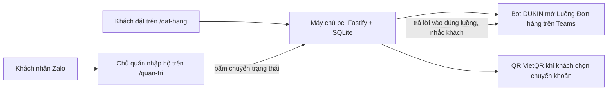

# Hướng dẫn vận hành DUKIN Cafe & Bistro

Tài liệu cho chủ quán tự cấu hình phần còn lại và vận hành lâu dài. Hệ thống đã chạy sẵn trên máy `pc`, container `dukin-cafe-app-1`, mã nguồn tại `~/projects/dukin-cafe`.

## Thông tin truy cập

| Thứ gì | Địa chỉ |
| --- | --- |
| Trang bán (khách) | `https://dukin.ontherunway.net/dat-hang` (bản dự phòng nội bộ qua Tailscale: `http://100.123.116.92:8090/dat-hang`) |
| Trang quản lý (chủ quán) | `https://dukin.ontherunway.net/quan-tri` |
| Mật khẩu quản trị | trong `~/projects/dukin-cafe/.env`, dòng `ADMIN_PASSWORD` |
| Khóa bot Teams | trong `.env`, dòng `TEAMS_WEBHOOK_SECRET` |
| Dữ liệu đơn | `~/projects/dukin-cafe/data/dukin.sqlite` |

Ba việc còn lại làm theo đúng thứ tự 1 tới 3, vì bot cần tên miền công khai mới nhận được sự kiện từ Teams.

## 1. Đổi mật khẩu quản trị

```bash
ssh pc
nano ~/projects/dukin-cafe/.env        # sửa dòng ADMIN_PASSWORD
cd ~/projects/dukin-cafe && docker compose up -d   # tạo lại container với mật khẩu mới
```

Đăng nhập lại ở `/quan-tri` bằng mật khẩu mới.

## 2. Cloudflare Tunnel (HTTPS công khai)

Mục này đã làm xong với tên miền `dukin.ontherunway.net` (Cloudflare Tunnel trỏ về `http://localhost:8090`, đã kiểm chứng HTTPS hoạt động). Ghi lại để đối chiếu cấu hình:

1. **Networks → Tunnels → Create a tunnel**, loại Cloudflared, đặt tên `dukin`.
2. Chạy lệnh cài connector mà trang hiện ra, ngay trên máy `pc` (chọn bản Docker hoặc gói hệ điều hành tùy cách bạn quản lý). Connector phải chạy thường trực.
3. Ở tab **Public Hostname** của tunnel: thêm hostname `dukin.ontherunway.net`, Service đặt **HTTP → `localhost:8090`**. DNS record tự tạo.
4. Kiểm tra: mở `https://dukin.ontherunway.net/dat-hang` thấy thực đơn là được.

## 3. Bot Teams (Bot DUKIN)

### 3.1 Đăng ký trên Azure Portal

1. **Microsoft Entra ID → App registrations → New registration**: tên `Bot DUKIN`, loại tài khoản chọn "Accounts in this organizational directory only" (Single tenant). Ghi lại **Application (client) ID** và **Directory (tenant) ID**.
2. Vào ứng dụng vừa tạo → **Certificates & secrets → New client secret** → copy ngay **Value** (chỉ hiện một lần). Đây là **App Secret**.
3. Tạo resource **Azure Bot** (Create a resource, tìm "Azure Bot"): phần Microsoft App ID dán App ID ở trên, loại Single Tenant.
4. Vào Azure Bot → **Configuration**: Messaging endpoint đặt:

   ```
   https://dukin.ontherunway.net/api/teams/events?secret=<TEAMS_WEBHOOK_SECRET trong .env>
   ```

   (đọc khóa: `ssh pc 'grep TEAMS_WEBHOOK_SECRET ~/projects/dukin-cafe/.env'`). Bấm Apply.
5. **Channels → Microsoft Teams** → bật kênh Teams.

### 3.2 Nạp cấu hình vào Trang quản lý

Vào `/quan-tri` → thẻ **Cấu hình** → mục Bot Teams: nhập Tenant ID, App ID, App Secret → **Lưu cấu hình**.

### 3.3 Cài bot vào nhóm

Trong Teams: mở nhóm bán cà phê → thanh ứng dụng → **... → Quản lý ứng dụng** (hoặc "+" ) → tìm `Bot DUKIN` → **Add to a team**, chọn nhóm. Ngay sau đó vào thẻ Cấu hình xem trường "Mã kênh conversation" đã tự điền.

### 3.4 Kiểm tra

Đặt một đơn thử ở `/dat-hang`:
- Kênh Teams có thẻ đơn mới mở Luồng Đơn hàng (mã đơn, món, khách, giờ đặt, tổng tiền), gắn thẻ những người đã khai trong mục "Báo cho ai khi có đơn mới".
- Ở `/quan-tri` bấm "Xác nhận": thẻ trả lời xuất hiện trong đúng luồng, kèm nhắc tên khách nếu khách có trong Danh bạ.
- Nếu đơn trong Trang quản lý còn nhãn "chưa lên Teams": xem log `docker compose logs -f app` trong thư mục dự án, tìm dòng "Teams:".

## 4. Thông tin bán hàng

Thẻ **Cấu hình** trong `/quan-tri`:

- **Thanh toán chuyển khoản**: chọn ngân hàng, nhập số tài khoản, tên chủ tài khoản. Khách chọn "Chuyển khoản" sẽ thấy mã QR VietQR sinh sẵn, nội dung chuyển khoản dạng `DUKIN #mãsố tênkhách` để đối chiếu.
- **Link Zalo**: hiện ở trang hoàn tất để khách tự nhắn khi cần đổi đơn.
- **Giới hạn đơn mỗi ngày**: mặc định 0 tức không giới hạn. Đặt một con số nếu muốn chặn những hôm quá tải; đủ trần thì Trang bán báo "hôm nay quán đã nhận đủ đơn" và khóa nút đặt.
- **Báo cho ai khi có đơn mới**: danh sách người phụ trách được Bot DUKIN gắn thẻ trên kênh Teams mỗi khi có đơn (chủ quán, người pha chế, người giao). Bấm "+ Chọn từ nhóm Teams", gõ tên hoặc email để tìm rồi bấm chọn. Kèm công tắc **Nhắc luôn Khách đặt đơn**, chỉ có tác dụng khi Khách đã được liên kết tài khoản Teams trong thẻ Danh bạ.

Thẻ **Danh bạ**: khách tự xuất hiện theo tên khi đặt. Tên khách là duy nhất không phân biệt hoa thường, nên "Hoàng Tuấn" và "hoàng tuấn" là một người; sửa lại chính tả ở đây thì các đơn cũ của người đó cũng đổi tên theo. Dấu tiếng Việt vẫn phân biệt: "Hoàng" và "Hoang" là hai người. Muốn bot nhắc ai thì bấm "+ Liên kết Teams" ở dòng của người đó rồi gõ tên hoặc email để tìm; danh sách lấy thẳng từ nhóm Teams đã cài Bot DUKIN nên không phải đi tìm mã ở đâu cả.

Không nhập mã Teams bằng tay nữa. Teams chỉ gắn thẻ được bằng mã dạng `29:...` lấy từ chính nhóm, không nhận email và cũng không nhận Object ID dạng `8:orgid:...` của Azure. Dòng nào còn mã kiểu cũ sẽ hiện nhãn "Mã không dùng được", bấm "Đổi" để chọn lại.

## 5. Vận hành thường ngày

- **Thẻ Thống kê**: doanh thu và tình trạng đặt đơn, xem theo Ngày (14 ngày gần nhất), Tuần (12 tuần), Tháng (12 tháng) hoặc Năm (5 năm). Có biểu đồ doanh thu, số ly đã pha, số khách, phân bố trạng thái đơn, cách khách đặt và nhận, món bán chạy và khách mua nhiều nhất. Doanh thu luôn bỏ đơn đã hủy.
- **Thẻ Đơn hàng**: mở ra là tab **Cần xử lý**, liệt kê mọi đơn chưa Hoàn tất và chưa Hủy, gom theo ngày khách đặt. Danh sách tự làm mới mỗi 20 giây và huy hiệu đỏ trên tab đếm số đơn mới, nên không cần tải lại trang. Tab **Theo ngày đặt** dùng để đối sổ một ngày cụ thể. Bấm nút chuyển trạng thái theo luồng: Mới → Đã xác nhận → Đã thu tiền → Hoàn tất (hoặc Hủy). Mỗi lần bấm, bot trả lời vào Luồng Đơn hàng trên Teams.
- **Sửa đơn**: mỗi thẻ đơn có nút "✏️ Sửa đơn" để đổi món, số lượng, tùy chọn, cách nhận, vị trí giao, ghi chú và cách thanh toán. Lưu xong Bot DUKIN trả lời ngay vào luồng của chính đơn đó trên Teams, nêu từng mục đổi kèm nội dung trước và sau, để cả nhóm đối chiếu mà không phải hỏi lại. Không có gì đổi thì không gửi gì. Sửa đơn không đụng Trạng thái Đơn hàng. Đơn đã Hủy thì khóa hẳn; đơn đã thu tiền hoặc đã hoàn tất vẫn sửa được nhưng hiện cảnh báo lệch tiền trước khi lưu.
- **Nhập hộ (Zalo)**: nút "+ Nhập hộ (Zalo)" để tạo đơn thay khách nhắn Zalo, đơn gắn nhãn Zalo.
- **Thẻ Thực đơn**: thêm, sửa, xóa món; mỗi món có nhóm tùy chọn (ví dụ Kích cỡ) với mức cộng giá từng lựa chọn; bỏ chọn "Còn bán" để ẩn món tạm thời.
- Không còn khung giờ nhận hàng: khách đặt lúc nào cũng được, quán tự liệu lúc nào pha và lúc nào giao. Khách muốn hẹn giờ thì viết vào ô Ghi chú.

## 6. Cập nhật mã khi có chỉnh sửa

Mã nằm trên GitHub `hoangvantuan/dukin-cafe`. Trên máy `pc` bản hiện tại là bản chép qua rsync, chuyển sang dùng git một lần:

```bash
ssh pc
cd ~/projects/dukin-cafe
git init
git remote add origin git@github.com:hoangvantuan/dukin-cafe.git
git fetch origin
git reset --hard origin/main    # .env và data/ không thuộc git nên được giữ nguyên
```

Các lần sau, mỗi khi có commit mới:

```bash
cd ~/projects/dukin-cafe && git pull && docker compose up -d --build
```

## 7. Sao lưu và phục hồi dữ liệu

Sao lưu (an toàn vì dừng ghi trong lúc nén):

```bash
ssh pc
cd ~/projects/dukin-cafe
docker compose stop app
tar czf ~/dukin-backup-$(date +%F).tgz data
docker compose start app
```

Máy `pc` có sẵn kopia: nên thêm đường dẫn `~/projects/dukin-cafe/data` vào chính sách backup hiện có để tự động hơn. Phục hồi: giải nén đè thư mục `data` rồi `docker compose up -d`.

## 8. Xử lý sự cố nhanh

| Hiện tượng | Việc làm |
| --- | --- |
| Không mở được trang | `ssh pc` rồi `docker ps` xem container `dukin-cafe-app-1` có chạy không; không thì `cd ~/projects/dukin-cafe && docker compose up -d` |
| Đơn không lên Teams | Xem mục 3.4; kiểm tra App Secret còn hiệu lực (Azure, secrets có hạn dùng) |
| Khám nhật ký | `cd ~/projects/dukin-cafe && docker compose logs -f --tail=100 app` |
| Khách báo quán đã đủ đơn | Đã chạm giới hạn đơn mỗi ngày, tăng hoặc đặt 0 trong thẻ Cấu hình |
| Bot không gắn thẻ đúng người | Vào Cấu hình mục 4 và thẻ Danh bạ, chọn lại người từ danh sách nhóm Teams |
| Không thấy đồng nghiệp trong ô tìm | Danh sách chỉ gồm người đã ở trong nhóm Teams cài Bot DUKIN. Mời họ vào nhóm rồi bấm ↻ tải lại |
| Sửa đơn xong Teams không báo | Đơn đó chưa mở được luồng (nhãn "Chưa lên Teams"); xem mục 3.4 |
| Không tải được danh sách nhóm Teams | Bot chưa được cài vào nhóm, hoặc App Secret hết hạn; xem mục 3.3 và 3.4 |
| Mất mật khẩu quản trị | Sửa lại `ADMIN_PASSWORD` trong `.env` rồi `docker compose up -d` |

## Tổng quan luồng hệ thống


