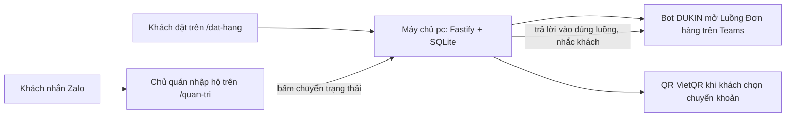

# Hướng dẫn vận hành DUKIN Cafe & Bistro

Tài liệu cho chủ quán tự cấu hình phần còn lại và vận hành lâu dài. Hệ thống đã chạy sẵn trên máy `pc`, container `dukin-cafe-app-1`, mã nguồn tại `~/projects/dukin-cafe`.

## Thông tin truy cập

| Thứ gì | Địa chỉ |
| --- | --- |
| Trang bán (khách) | `https://dukin.hoangvantuan.com/dat-hang` (bản dự phòng nội bộ qua Tailscale: `http://100.123.116.92:8090/dat-hang`) |
| Trang quản lý (chủ quán) | `https://dukin.hoangvantuan.com/quan-tri` |
| Mật khẩu quản trị | trong `~/projects/dukin-cafe/.env`, dòng `ADMIN_PASSWORD` |
| Khóa bot Teams | trong `.env`, dòng `TEAMS_WEBHOOK_SECRET` |
| Dữ liệu đơn | `~/projects/dukin-cafe/data/dukin.sqlite` |

Ba việc còn lại làm theo đúng thứ tự 1 tới 3, vì bot cần tên miền công khai mới nhận được sự kiện từ Teams.

## 1. Đổi mật khẩu quản trị

```bash
ssh pc
nano ~/projects/dukin-cafe/.env        # sửa dòng ADMIN_PASSWORD
cd ~/projects/dukin-cafe && docker compose up -d   # tạo lại container với mật khẩu mới
```

Đăng nhập lại ở `/quan-tri` bằng mật khẩu mới.

## 2. Cloudflare Tunnel (HTTPS công khai)

Mục này đã làm xong với tên miền `dukin.hoangvantuan.com` (Cloudflare Tunnel trỏ về `http://localhost:8090`, đã kiểm chứng HTTPS hoạt động). Ghi lại để đối chiếu cấu hình:

1. **Networks → Tunnels → Create a tunnel**, loại Cloudflared, đặt tên `dukin`.
2. Chạy lệnh cài connector mà trang hiện ra, ngay trên máy `pc` (chọn bản Docker hoặc gói hệ điều hành tùy cách bạn quản lý). Connector phải chạy thường trực.
3. Ở tab **Public Hostname** của tunnel: thêm hostname `dukin.hoangvantuan.com`, Service đặt **HTTP → `localhost:8090`**. DNS record tự tạo.
4. Kiểm tra: mở `https://dukin.hoangvantuan.com/dat-hang` thấy thực đơn là được.

## 3. Bot Teams (Bot DUKIN)

### 3.1 Đăng ký trên Azure Portal

1. **Microsoft Entra ID → App registrations → New registration**: tên `Bot DUKIN`, loại tài khoản chọn "Accounts in this organizational directory only" (Single tenant). Ghi lại **Application (client) ID** và **Directory (tenant) ID**.
2. Vào ứng dụng vừa tạo → **Certificates & secrets → New client secret** → copy ngay **Value** (chỉ hiện một lần). Đây là **App Secret**.
3. Tạo resource **Azure Bot** (Create a resource, tìm "Azure Bot"): phần Microsoft App ID dán App ID ở trên, loại Single Tenant.
4. Vào Azure Bot → **Configuration**: Messaging endpoint đặt:

   ```
   https://dukin.hoangvantuan.com/api/teams/events?secret=<TEAMS_WEBHOOK_SECRET trong .env>
   ```

   (đọc khóa: `ssh pc 'grep TEAMS_WEBHOOK_SECRET ~/projects/dukin-cafe/.env'`). Bấm Apply.
5. **Channels → Microsoft Teams** → bật kênh Teams.

### 3.2 Nạp cấu hình vào Trang quản lý

Vào `/quan-tri` → thẻ **Cấu hình** → mục Bot Teams: nhập Tenant ID, App ID, App Secret → **Lưu cấu hình**.

### 3.3 Cài bot vào nhóm

Trong Teams: mở nhóm bán cà phê → thanh ứng dụng → **... → Quản lý ứng dụng** (hoặc "+" ) → tìm `Bot DUKIN` → **Add to a team**, chọn nhóm. Ngay sau đó vào thẻ Cấu hình xem trường "Mã kênh conversation" đã tự điền.

### 3.4 Kiểm tra

Đặt một đơn thử ở `/dat-hang`:
- Kênh Teams có tin mới mở Luồng Đơn hàng (mã đơn, món, khách, khung nhận, tổng tiền).
- Ở `/quan-tri` bấm "Xác nhận": tin trả lời xuất hiện trong đúng luồng, kèm nhắc tên khách nếu khách có trong Danh bạ.
- Nếu đơn trong Trang quản lý còn nhãn "chưa lên Teams": xem log `docker compose logs -f app` trong thư mục dự án, tìm dòng "Teams:".

## 4. Thông tin bán hàng

Thẻ **Cấu hình** trong `/quan-tri`:

- **Thanh toán chuyển khoản**: chọn ngân hàng, nhập số tài khoản, tên chủ tài khoản. Khách chọn "Chuyển khoản" sẽ thấy mã QR VietQR sinh sẵn, nội dung chuyển khoản dạng `DUKIN #mãsố tênkhách` để đối chiếu.
- **Link Zalo**: hiện ở trang hoàn tất để khách tự nhắn khi cần đổi đơn.
- **Giới hạn đơn mỗi khung**: mặc định 30, khung đầy thì khách không chọn được khung đó. Đặt 0 nếu không giới hạn.

Thẻ **Danh bạ**: khách tự xuất hiện theo tên khi đặt. Muốn bot nhắc ai thì nhập mã Teams của người đó, dạng `8:orgid:<Object ID>`. Lấy Object ID: Azure Portal → Microsoft Entra ID → Users → chọn người → cột Object ID.

## 5. Vận hành thường ngày

- **Thẻ Đơn hàng**: chọn ngày nhận, đơn chia theo Khung sáng và Khung chiều kèm tổng doanh thu. Bấm nút chuyển trạng thái theo luồng: Mới → Đã xác nhận → Đã thu tiền → Hoàn tất (hoặc Hủy). Mỗi lần bấm, bot trả lời vào Luồng Đơn hàng trên Teams.
- **Nhập hộ (Zalo)**: nút "+ Nhập hộ (Zalo)" để tạo đơn thay khách nhắn Zalo, đơn gắn nhãn Zalo.
- **Thẻ Thực đơn**: thêm, sửa, xóa món; mỗi món có nhóm tùy chọn (ví dụ Kích cỡ) với mức cộng giá từng lựa chọn; bỏ chọn "Còn bán" để ẩn món tạm thời.
- Khung nhận hàng cố định theo bảng thuật ngữ: sáng 7:00 tới 10:30, chiều 13:30 tới 17:00, giờ chốt 10:00 (đặt sau 10:00 thì sớm nhất nhận sáng hôm sau).

## 6. Cập nhật mã khi có chỉnh sửa

Mã nằm trên GitHub `hoangvantuan/dukin-cafe`. Trên máy `pc` bản hiện tại là bản chép qua rsync, chuyển sang dùng git một lần:

```bash
ssh pc
cd ~/projects/dukin-cafe
git init
git remote add origin git@github.com:hoangvantuan/dukin-cafe.git
git fetch origin
git reset --hard origin/main    # .env và data/ không thuộc git nên được giữ nguyên
```

Các lần sau, mỗi khi có commit mới:

```bash
cd ~/projects/dukin-cafe && git pull && docker compose up -d --build
```

## 7. Sao lưu và phục hồi dữ liệu

Sao lưu (an toàn vì dừng ghi trong lúc nén):

```bash
ssh pc
cd ~/projects/dukin-cafe
docker compose stop app
tar czf ~/dukin-backup-$(date +%F).tgz data
docker compose start app
```

Máy `pc` có sẵn kopia: nên thêm đường dẫn `~/projects/dukin-cafe/data` vào chính sách backup hiện có để tự động hơn. Phục hồi: giải nén đè thư mục `data` rồi `docker compose up -d`.

## 8. Xử lý sự cố nhanh

| Hiện tượng | Việc làm |
| --- | --- |
| Không mở được trang | `ssh pc` rồi `docker ps` xem container `dukin-cafe-app-1` có chạy không; không thì `cd ~/projects/dukin-cafe && docker compose up -d` |
| Đơn không lên Teams | Xem mục 3.4; kiểm tra App Secret còn hiệu lực (Azure, secrets có hạn dùng) |
| Khám nhật ký | `cd ~/projects/dukin-cafe && docker compose logs -f --tail=100 app` |
| Khách không chọn được khung | Khung đã đủ giới hạn, tăng trong thẻ Cấu hình |
| Mất mật khẩu quản trị | Sửa lại `ADMIN_PASSWORD` trong `.env` rồi `docker compose up -d` |

## Tổng quan luồng hệ thống


